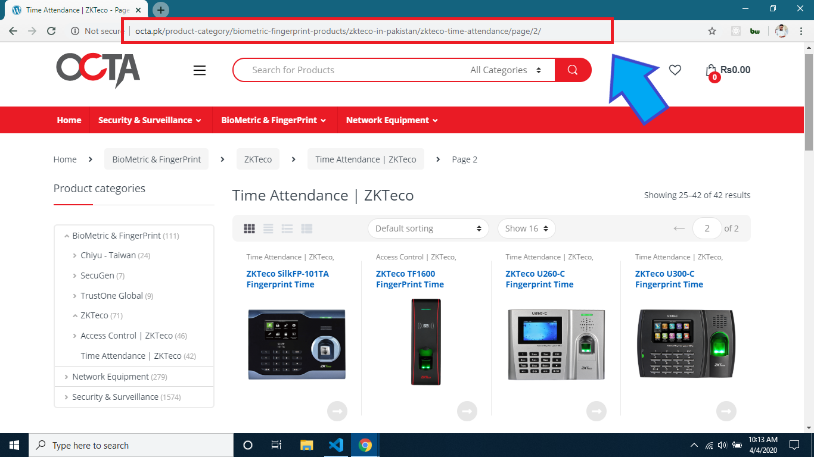
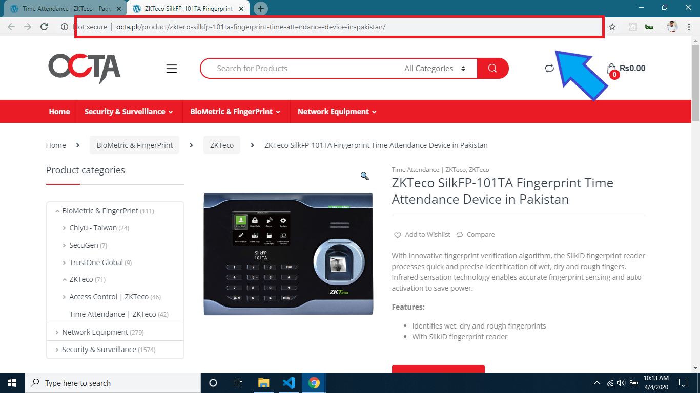
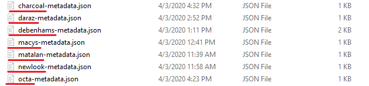
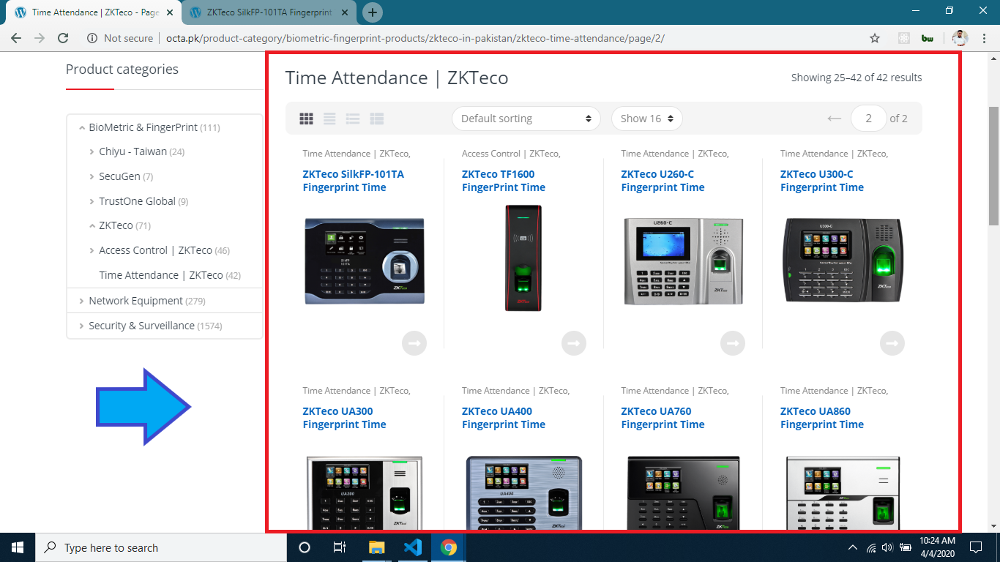
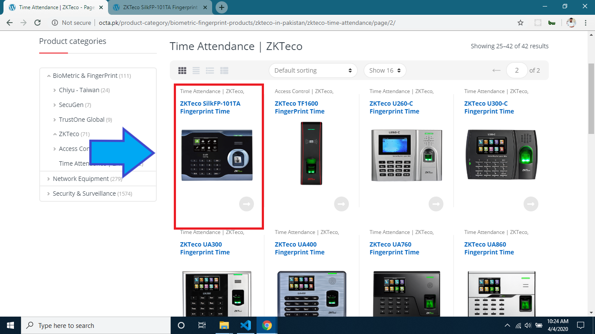
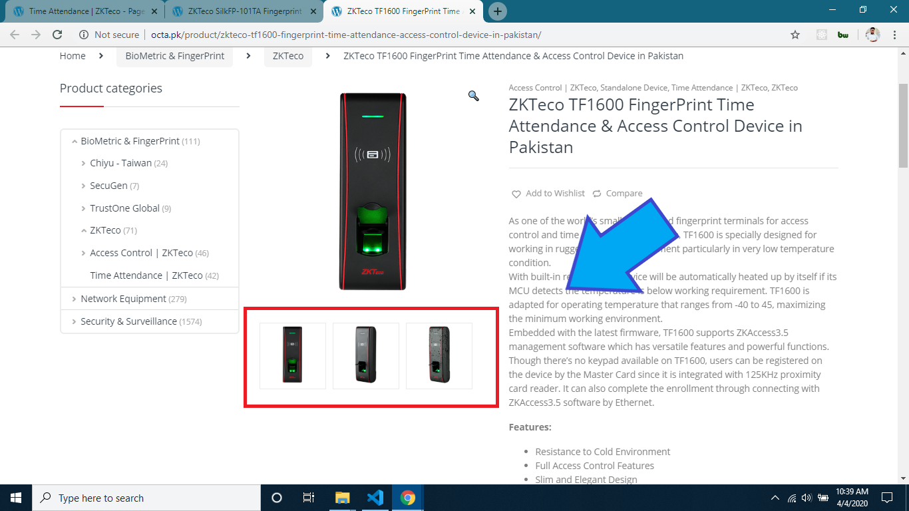
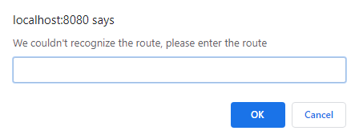
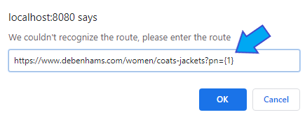

# Node GUI Based Web Scraper 

A script written in NodeJS for crawling and extracting structured data from e-commerce websites for different purposes.

## User Guide

### Installation

- Clone or download the repository 
- run this command for installing the dependencies `npm install`
- run this command for using the app `npm start`
- you can access the app on port `8080` 
    - open your browser and go to `localhost:8080` for accessing the app

### Getting Started

Below is your step by step guide to using the application for crawling the web pages

#### 1. Enter Website URL (Product Catalog Page)

You are requested to enter url of the webpage which contains the products. Below is the graphical example of the url you need to enter

#### 2. Enter Website Second Page URL (Product Catalog Second Page)

You are requested to enter url of the second webpage which contains the products.We'll use this URL for recognizing paths. Below is the graphical example of the url you need to enter

#### 3. Enter Individual Product URL

You are requested to enter any product URL so that we can open it for you to choose the details you want to scrape.

#### 4. Enter Brand Name

You are requested to enter any brand name, we'll use this for naming your metadata.

#### 5. Choose Main Container

You are requested to click the button which is in that field for choosing main container (which contains all the prducts)

#### 6. Choose Individual Product

You are requested to click the button which is in that field for choosing individual product

#### 7. Choose Product Images

You are requested to click the button which is in that field for choosing product images

#### 8. Enter Column Name

We've added this for you so that you can enter the fields or columns or data you want to scrap from website,
all you have to do is just enter the field name press enter a new text element will be generated automatically, Now do the same process for choosing elements you want to scrape 

#### 9. Check Metadata [optional]

We've added this for your ease that so that you can see the data of the elements which you've selected if there's any changing you can do this right-away.

#### 10. Save Metadata

You are requested to click this button when you are done will all that, it will create a metadata file of the things which you've selected or choosen so far.

#### 11. Upload Metadata

You are requested to upload metadata, so that the server load the data which you want to scrape.

#### 12. Scraping Products

- Enter start page of the website
- Enter end page of the website
- Click on scrap products to `start scraping`

#### 13. Viewing data

Click on the View data button to show the data which is scraped from the website when it will be done

#### 14. Exporting data

click on the `Generate CSV` button to download the scraped data

### Actions Guide

##### 1. Enter Custom path

if the URL path is not recognized by our application the app will ask you enter the custom so all you have to do is just paste the website path to the input dialog and where there is page index wrap this with `{} curly braces` so that we increment its value for nex pages. It is recommended that first please check the path before then enter it

Suppose this is the url of the website 
`https://www.debenhams.com/women/coats-jackets?pn=1`
just note that there is pn which can be short term for **page number** and is set to **1** which means that
the website is showing you page 1, now test this url to your browser by replaced **pn=1** to **pn=2**. If the browser shows you the next page then you can enter this to that dialog. but don't forget to `wrap the page index with braces` so that we can increment its value to moving to next pages.

##### 2. CSV Operation Guide

Below is your guide for applying operations in csv stuff

- `select column` on which you want to apply action, from the column name list which is provided to you
- Available actions
    - Replace
    - Append
    - Prepend
    - Maths Operation (only work on price field)
- **For Replace**
    - Enter data you want to replace and then click on replace a new modal will be shown to you asking which data you want to replace this inputted data. so u've to enter the existing data which you want to replace. After clicking **OK** you will see the changes
    - You can also delete a value using this action to delete a text you just have to input **del** then a dialog box will appear asking you what to replace with type the text you want to delete it will be deleted from the table
- **For Append**
    - After choosing column, enter data you want to append and then click on the append action. your inputted data will be appended to that column
- **For Prepend**
    - After choosing column, enter data you want to prepend and then click on the append action. your inputted data will be prepended to that column
- **For Maths-Opeation**
    - This action is only valid to price column, to apply a maths operations you just have enter **_** (underscore) on either the start of the expression or end of the expression then wrap your expression with `[]` square brakcets and write your expression. **It is important because, it is specify the table data** for example : the data in the table is **235** so if i have to do addition operation i write 
    `[+2]_` {here underscore specify tha table data } *2+235*
    - Suppose we've to divide the existed value with 2 so we've to write the expression as
    `_[/2]` *235 / 2*
    - you can write the complete mathematical expressions like suppose i've to increase it's value by 20% so i've to first take out 20% of the number then add this to the existing value so if you want to use the table data again in the expression you can use *@* . The expression for this can be written as:
        - **[ ( (@/100) * 20 ) + ]_** : this expression means = `((235/100) * 20)+235`**`
    - `It is necessary that the under must be either at the start or at the end followed by square braces with no space between them. you can use space between braces`
    - **Some Examples**
        - `_[+3]` **valid expression**
        - `_ [+3]` **invalid expression because after underscore there is space**
        - `[+3]_` **valid expression**
        - `[+3] _` **invalid expression because before underscore there is space**
        - `[ +3 ]_` **valid expression**
        - `_[ +3 ]` **valid expression**
    
`To Restore the table into it's default state just click again the view data button`